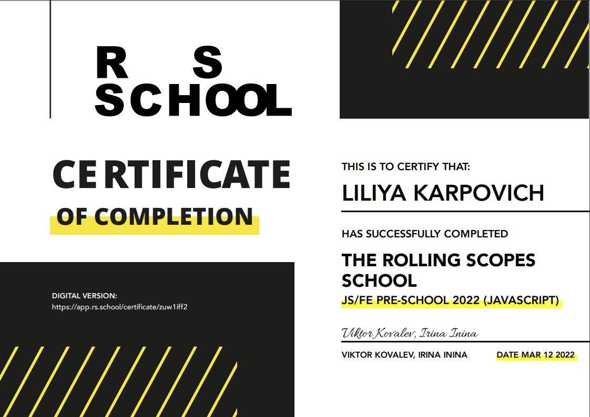

# ***Liliya Karpovich***


## *Contacts*
* **Address:** Minsk, Belarus
* **Phone:** +375257896737
* **E-mail:** karpovich.liliya21@gmail.com
* **Discord:** Liliya(@karpovich-liliya)

## *About Me*
I am 30 years old, I work as a researcher. My goal is to gain knowledge in the field of front-end development.

## *Skills*
* HTML
* CSS
* Javascript
* Git/GitHub
* Figma

## *Education*
* *2008 - 2013* Belarusian State Technological University, ***Energy Engineer***
* *2013 - 2014* Belarusian State Technological University, ***Master of Science in Engineering***
* *2014 - 2017* Joint Institute for Energy and Nuclear Research Sosny of the National Academy of Sciences of Belarus, ***Researcher in Engineering Science***
* *2021 - 2022* Подготовительный курс «JavaScript/Front-end. Stage 0», RS-School



## *Code Examples*
``` function toggleVideo() {
    if (!video.paused) {
        video.pause();
        playBtn.classList.remove('play');
        playerBtn.classList.remove('play');
    } else {       
        video.play();
        playBtn.classList.add('play');
        playerBtn.classList.add('play');
        videoPlayer.classList.add('play');
    } 
}; 
```

## *English*
A1 - Beginner

## *Project*
* [Portfolio](https://rolling-scopes-school.github.io/karpovich-liliya-JSFEPRESCHOOL/portfolio/)
* [Image galery](https://rolling-scopes-school.github.io/karpovich-liliya-JSFEPRESCHOOL/image-galery/)
* [Memory game](https://rolling-scopes-school.github.io/karpovich-liliya-JSFEPRESCHOOL/memory-game/)
* [Shelter](https://rolling-scopes-school.github.io/karpovich-liliya-JSFE2022Q1/shelter/pages/main/)
